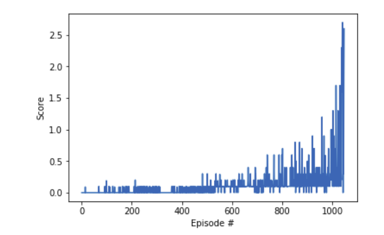

# Project Collaboration and Competition

## Overview

The project aims to train two agents to play tennis by themself. The two agents control rackets to bounce a ball over a net. If an agent hits the ball over the net, it receives a reward of +0.1.  If an agent lets a ball hit the ground or hits the ball out of bounds, it receives a reward of -0.01.  Thus, the goal of each agent is to keep the ball in play.

The observation space consists of 8 variables corresponding to the position and velocity of the ball and racket. Each agent receives its own, local observation.  Two continuous actions are available, corresponding to movement toward (or away from) the net, and jumping. 

## Environment 

The environment for this purpose is the tennis environment on the Unity ML-Agents GitHub page. 
The task is episodic, and in order to solve the environment, the agents must get an average score of +0.5 (over 100 consecutive episodes, after taking the maximum over both agents). The score for is calculated as follows.  
At the end of each episode, we add up the rewards that each agent received (without discounting), to get a score for each agent. This yields 2 (potentially different) scores. We then take the maximum of these 2 scores.  
This is used to calculate a single score for each episode.  

The environment is considered solved, when the average (over 100 episodes) of those scores is at least +0.5.

## Implementation Details

The problem is solved using the Multi agent Deep Deterministic Policy Gradient (maddpg) algorithm with a replay buffer. The algorithm used was obtained from the paper Multi-Agent Actor-Critic for Mixed
Cooperative-Competitive Environments by Ryan Lowe et al. The agents can have different actor and critic networks. For the solution presented agents share the same actor network while the critic network is different for both agents. Randon noise was implemented instead of Qu noise for actions. 

### Network Architecture

The network used for training comprised of 3 layers. The input for the network comprised of 33 different states.
Three fully connected hidden layers were used for both critic and actor. The actor network is as follows  
Input - 24 states  
Layer1 - 512 neurons   
Layer2 - 256 neurons    
Output - 2 actions  
For all the hidden layers Relu activation functions were used.   
While the critic network also comprises of 3 layers.  
The actor network is as follows  
Input - 24 states and action  
Layer1 - 512 neurons    
Layer2 - 256 neurons    
Output - 1
The  Relu action functions is used for both the hidden layers. Dropouts were used for both the critic hidden layers to prevent overfitting of the network. The propablity of 0.5 and 0.2 were used respectively for hidden layer 1 and hidden layer 2.

### Hyperparameters

The most important hperpaparamters and their respective values used while training the network are given as follows:  

Replay buffer size = 1000000  
Batch size = 256  
Discount factor(gamma) = 0.99  
Tau = 0.02 (soft update parameter)  
Learning rate actor = 0.0001  
Learning rate critic = 0.0001 

All the agents were updated 10 times every 20 time steps

## Result

The agent achieved the expected accuracy of +0.5 after 1046 episodes of training.
The max of score obtained by the agents in each episode is shown below
.

## Future work

The environment was solved with a maddpg algorithm with a good overall accuracy with a very few linear layers. One future score can be to implement  priotirized experience replay for accelerating training. Also try different replay buffer for critic and actor networks. Try to use parameter space noise rather than noise on action. 
